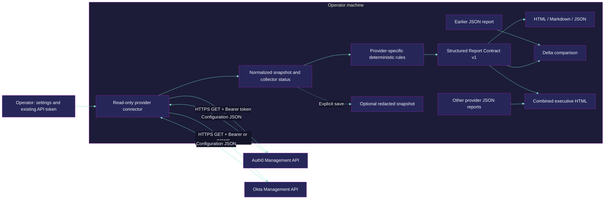
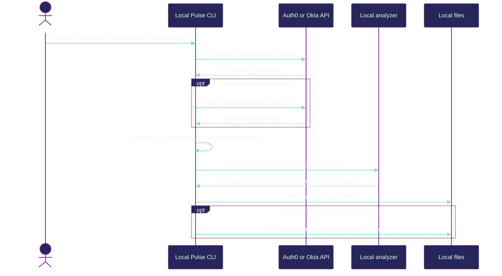
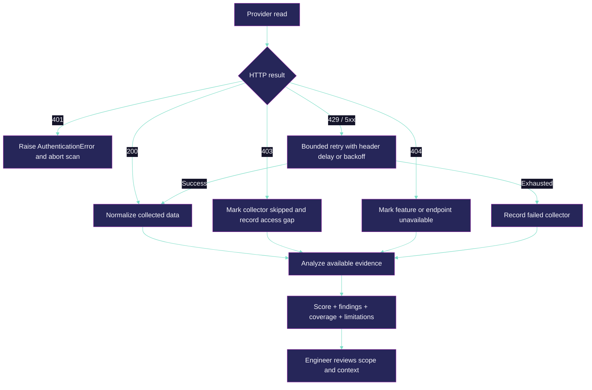

# Identity Pulse — editable architecture diagrams

These diagrams describe the checked-in CLI at the time this demo was built. The interactive browser workspace is a proposed presentation layer. Credentials and payloads in the demo are placeholders or synthetic examples.

## Assessment architecture

An alternate `--from-snapshot` path loads local JSON directly for analysis and skips provider collection. Current import validation and sanitization are incomplete; do not treat an arbitrary imported file as trusted evidence.

## Read-only API collection

Auth0 app collection uses `/api/v2/clients` with `page`, `per_page` and `include_totals=false`. Okta app collection uses `/api/v1/apps?limit=200`, then follows `Link: rel="next"`. These are implementation examples; endpoint-dependent fields and collection bounds vary. The current Okta next-link path lacks an origin guard; task 046 tracks that issue and related HTTP safety work.

## Error and interpretation boundaries

Missing data is not a passed control. Current nested-collector coverage and delta resolution semantics need further hardening. A finding absent in a later report does not, by itself, prove remediation.

## Code reference map

Paths are relative to the repository root.

| Concern | Implementation |
| --- | --- |
| Auth0 HTTP and pagination | `src/connectors/auth0/auth0.client.ts` |
| Auth0 resource reads and status handling | `src/connectors/auth0/auth0.collectors.ts` |
| Okta HTTP, authentication and Link pagination | `src/connectors/okta/okta.client.ts` |
| Okta resource reads and normalization | `src/connectors/okta/okta.collectors.ts` |
| CollectorResult / coverage | `src/core/schema.ts` |
| Provider analysis | `src/analysis/auth0/`, `src/analysis/okta/` |
| Structured JSON report | `src/reporting/json/report-contract.types.ts` |
| Delta comparison | `src/reporting/delta/delta-compare.ts` |
| Combined summary | `src/reporting/combined/combined-summary.ts` |
| Current limitations and backlog | `agentic/tasks/ASSESSMENT-2026-09-26.md` |
